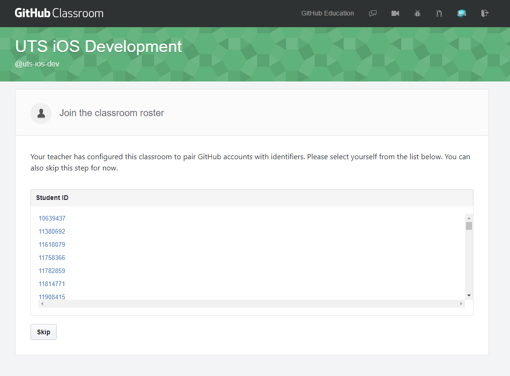
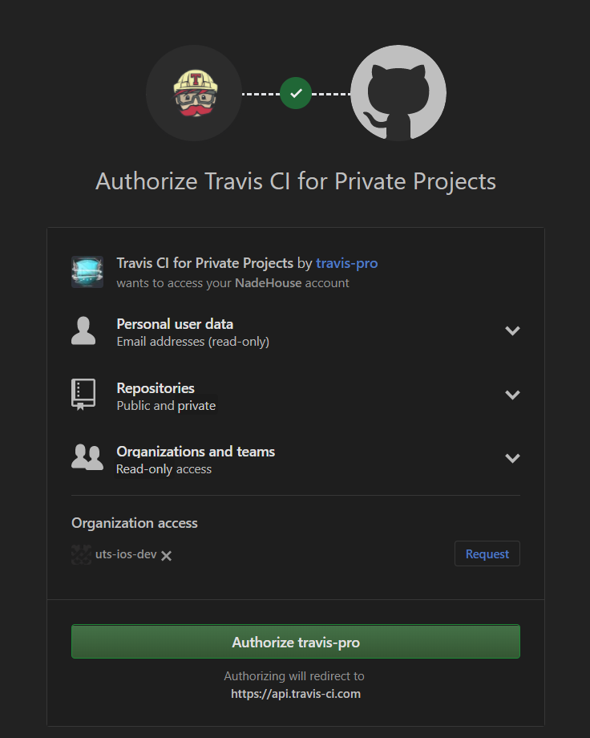

Faculty of Engineering and Information Technology School of Software

41889 - Application Development in the iOS Environment 42889 - iOS Application Development Autumn 2019

## Continuous Integration Instructions

1. Create a [GitHub](https://github.com/) account
2. Sign up for the [Student Developer Pack](https://education.github.com/pack)
3. Join the "uts-ios-dev" GitHub classroom using this link:
   https://classroom.github.com/a/bMixJsJ2
4. Select your Student ID
    
5. Accept the calc project
    
6. Go to http://travis-ci.com/ and select "Sign in with GitHub" (note that travis-ci **.com** is for private repositories, and travis-ci **.org** is for public repositories)
    
7. Select "Authorize travis-pro"
    
8. On Travis, go to your [profile](https://travis-ci.com/profile) page and enable this project

   
9. Now when you upload code to this repo, you can see the project compile and test on Travis.
